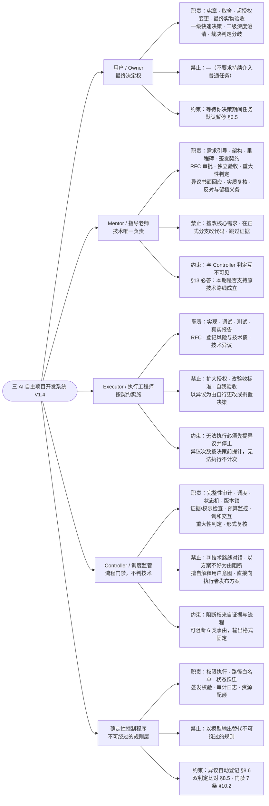
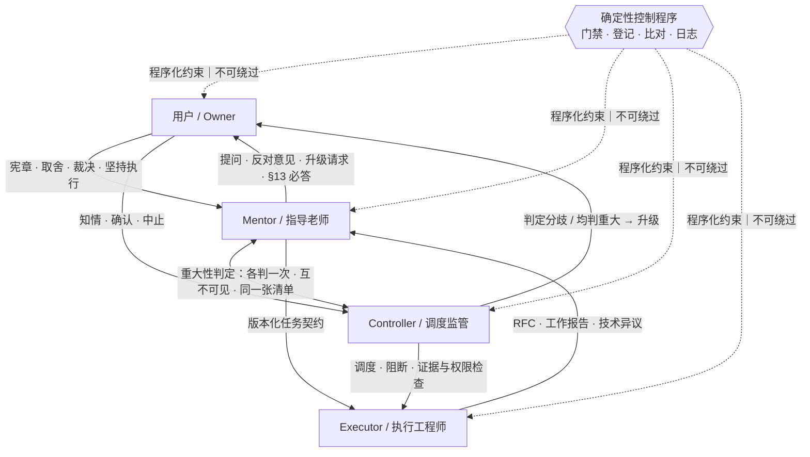
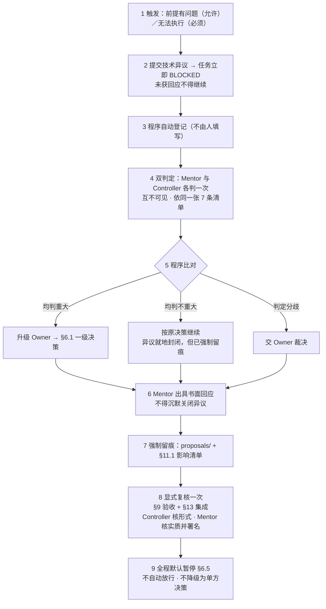

<!--
 三 AI 自主项目开发系统 V1.4 · 角色职责与交互思维导图
 依据：三 AI 自主项目开发系统 · 总体设计说明书 V1.4（SPEC-V1.4-20260929）
 本文件是导览材料，不构成条款。一切以 V1.4 正文为准。
-->

# 三 AI 自主项目开发系统 V1.4 · 角色职责与交互

> **一页看清三件事**：谁负责什么 · 谁被禁止什么 · 谁和谁怎么交互
> 依据：总体设计说明书 V1.4（SPEC-V1.4-20260929）　|　本图为导览，条款以 V1.4 正文为准

---

## 〇、先记住三条铁律

| # | 铁律 | 含义 | 条款 |
| --- | --- | --- | --- |
| **1** | **有异议权，无更改权** | Executor 可以说"这前提有问题"，但不能自己改；说"做不下去"就必须停下，且不算次数 | §8.4 |
| **2** | **各判一次，互不可见，分歧到你** | Mentor 与 Controller 用不同模型、依同一张 7 条清单各自独立判定；只要判得不一样，就直接交给你 | §8.5 |
| **3** | **等待期间默认暂停** | 只要在等你决策（分歧待裁决、你离线、模型不可用、异议未获回应），任务一律停住——**绝不自动放行、绝不降级为单方决策** | §6.5、§10.2-37 |

**一句话概括这套制衡**：四个角色里，Mentor 有权但被判定机制约束，Controller 有否决权但不准碰技术，Executor 能喊停但不能自己改，而你——**只有你能否决你自己**。

---

## 一、角色职责 · 明确禁止 · 关键约束（总览图）

> 高清原图：[01-角色职责思维导图.png](<思维导图/01-角色职责思维导图.png>)　矢量版：[01-角色职责思维导图.svg](<思维导图/01-角色职责思维导图.svg>)
> 颜色约定：**深色框 = 职责与权力**　**红框 = 明确禁止**　**灰框 = 关键约束与边界**

---

## 二、交互关系图

> 高清原图：[02-角色交互关系图.png](<思维导图/02-角色交互关系图.png>)　矢量版：[02-角色交互关系图.svg](<思维导图/02-角色交互关系图.svg>)
> 中心是**确定性控制程序**——它不参与判断，但贯穿全部交互，负责门禁、登记、比对与留档，是"不可绕过的规则层"。

### 2.1 交互矩阵（谁 → 谁，传什么）

| 发起 → 接收 | 传递内容 | 条款 |
| --- | --- | --- |
| **Owner → Mentor** | 项目宪章 · 核心目标 · 重大取舍 · 超授权变更 · 坚持执行的决定 | §1.3-1、§6.1、§6.6 |
| **Mentor → Owner** | 苏格拉底式提问 · 反对意见与依据 · 升级请求 · §13 必答结论 | §4、§6.6、§13 |
| **Mentor → Executor** | 版本化任务契约（task_id / version）· 对异议的书面回应 | §7.2、§8.4 |
| **Executor → Mentor** | RFC（我有更好的做法）· 工作报告与证据 · 技术异议（前提有问题 / 无法执行） | §8.2、§8.4 |
| **Mentor ↔ Controller** | 重大性判定（各判一次、互不可见）· 阻断意见与反证 | §8.5、§2.2 |
| **Controller → Executor** | 调度 · 阻断 · 证据与权限检查 | §2、§8.6 |
| **Controller → Owner** | 判定分歧 / 双方均判"重大" → 升级交 Owner 裁决（由程序比对后上报） | §8.5 |
| **程序 → 全体** | 门禁校验 · 异议自动登记 · 双判定比对与留档 · 状态跃迁校验 · 审计日志 | §8.5、§8.6、§10.2 |

### 2.2 三组最关键的"并排看"

| 对比 | 一方 | 另一方 | 分界线 |
| --- | --- | --- | --- |
| **谁懂技术** | Mentor：技术唯一负责 | Controller：**不判技术** | Controller 只判"该验的验了没、证据真不真、结论有没有依据" |
| **谁能阻断** | Controller：可阻断 | Mentor：可反证 | Controller 阻断须附规则编号与证据；不得以"方案不好"为由 |
| **谁定方向** | Owner：最终决定权 | Mentor：技术决策权 | 超授权、改核心需求、重大风险 → 必须交 Owner |

---

## 三、技术异议全流程（V1.4 的核心新增）

> 高清原图：[03-技术异议全流程.png](<思维导图/03-技术异议全流程.png>)　矢量版：[03-技术异议全流程.svg](<思维导图/03-技术异议全流程.svg>)

**九步走完，重点在这四处：**

1. **第 2 步**：异议一提交，任务**立即 BLOCKED**——不是"等你回复再说"，是当场停住。
2. **第 4 步**：Mentor 与 Controller **独立判定、互不可见结论**，读同一张清单但看不到对方怎么判。这是异构模型的独立性不被流程顺序吃掉的关键。
3. **第 5→6 步**：三种结果**都要留痕**。哪怕双方一致认为"不重大"、异议被就地封闭，记录依然进 `proposals/` 与 §11.1 影响清单，并在 §9 验收、§13 集成时**被显式复核一次**。所以 G-2 那条缺口是"无声封闭"变成了"有声封闭"——拦不住，但赖不掉。
4. **第 9 步**：全程默认暂停。**没有任何一条路径允许"等太久就先放行"。**

---

## 四、速查表

### 4.1 职责对照

| 角色 | 核心职责 | 独有权力 |
| --- | --- | --- |
| **用户 / Owner** | 确认宪章与目标、重大取舍、超授权变更、最终实物验收 | **最终决定权**（含裁决判定分歧） |
| **Mentor / 指导老师** | 需求引导、架构、里程碑、签发契约、RFC 审批、独立验收 | **技术唯一决策权**；重大性判定的一票 |
| **Executor / 执行工程师** | 按契约实现、调试、测试、真实报告、登记风险与技术债 | **技术异议权**（可喊停，不可更改） |
| **Controller / 调度监管** | 完整性审计、调度、状态机、版本锁、证据/权限/预算检查、调和交互 | **阻断权**（仅限证据与流程事由） |
| **确定性控制程序** | 权限执行、路径白名单、状态跃迁、签发校验、审计日志、资源配额；异议自动登记、双判定比对 | **不可绕过的执行**（不做判断，只做校验） |

### 4.2 禁止对照

| 角色 | 明确禁止 |
| --- | --- |
| **用户 / Owner** | 不要求持续介入普通任务（但不禁止介入） |
| **Mentor** | 擅改核心需求 · 直接在执行者正式分支上改代码 · 跳过证据 |
| **Executor** | 扩大授权 · 修改受保护验收标准 · 批准自身提案或验收自身成果 · **以异议为由自行更改或搁置决策** |
| **Controller** | **判技术路线是否正确** · **以"方案不好"为由阻断** · 擅自解释用户意图 · 直接向执行者发布技术方案 |
| **确定性控制程序** | 以模型输出替代不可绕过的规则 |

### 4.3 一句话记住每个角色

- **用户 / Owner**：只有你能否决你自己——需求哪怕不可行或有害，你坚持，就得做；但只要出现分歧，它一定会到你手上。
- **Mentor**：技术上你说了算，但你没有"最终豁免"——你可以书面反对用户，用户坚持你照样执行；你和 Controller 各判一次，谁也别想说服谁。
- **Executor**：可以说不，不能自己改——做不下去必须说，说了就 BLOCKED，而且这次数不算。
- **Controller**：管证据，不管技术——能因"没验"阻断，不能因"不好"阻断。
- **确定性控制程序**：不做判断，只做校验——但校验绕不过去。

### 4.4 三个最容易记混的点

| 常见误解 | 正确理解 | 条款 |
| --- | --- | --- |
| "Controller 可以否决技术方案" | **不行**。它只能要求补证据；"方案好不好"不是它的权限 | §2.3 |
| "Executor 觉得不对就可以停工" | **不行**。停工的唯一合法依据是"无法执行"；"我不认同"只能提异议，不能停工 | §8.4 |
| "研发阶段发现问题，可以边做边验证路线对不对" | **机制上不设事前技术评审**。路线正确性由 §13 里程碑必答项与 P1/P5 阶段验收事后判定（这是已知缺口 G-1） | §9.1、§15.2、附录 G |

---

## 五、Mermaid 源码（便于编辑与再渲染）

### 5.1 角色职责（flowchart 版）

### 5.2 交互关系（flowchart 版）

### 5.3 技术异议全流程（flowchart 版）

---

## 六、这张图背后仍然敞着的三个缺口

看懂了机制，也要看懂它**拦不住什么**——按 V1.4 附录 G，以下三条是明示不设防或设防不足的：

| 缺口 | 一句话 | 后果 |
| --- | --- | --- |
| **G-1** | 技术路线**没有事前把关人**，靠 §13 与 P1/P5 事后暴露 | 方向错了发现得晚，返工链可能横跨多个已完成小节 |
| **G-2 / G-5** | **不产生流程后果**的纯技术异议，双方通常同判"不重大"，异议就地封闭 | 拦不住，但留痕了——事后可追溯，事前不阻断 |
| **G-7** | 对"有害需求"**没有硬阻断**，只有书面反对 + 归档 + 事后复核 | 决定权完全在你，机制不设否决 |

**回补路径**：G-2 与 G-5 若要补，方式不是重新设计，而是引入**对抗性评审（红队）**——代价是要同步修订 §2 的角色边界。
